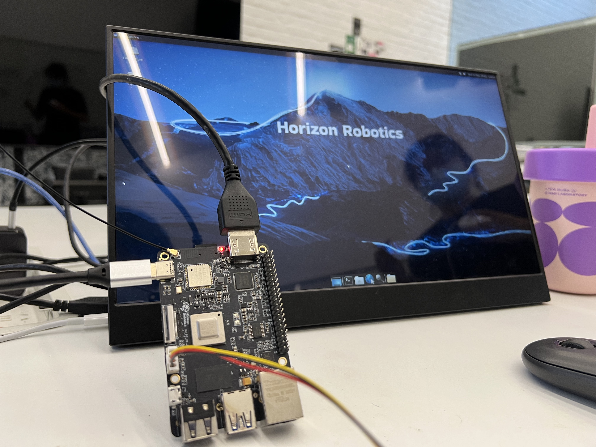
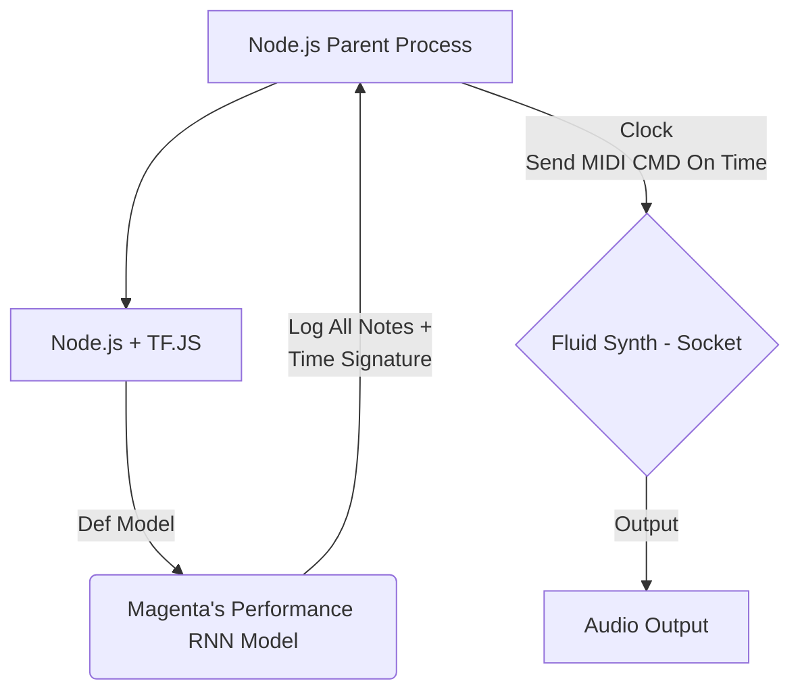

# rnn-jukebox
A node-driven infinite piano jukebox based on Magenta's performance-rnn, make to run on Horizon Sunrise X3 Pi or Raspberry Pi (CPU)


---

`Hardware (X3Pi)`



`Output (MP4)`

<video src="https://raw.githubusercontent.com/luan007/rnn-jukebox/main/imgs/output.mp4?ver=4" controls style="max-width: 400px;"></video>


----

# How does it work?



At its core, the jukebox is driven by `Magenta's Performance RNN ` (Original Model: https://github.com/magenta/magenta/blob/main/magenta/models/performance_rnn/README.md),
running on `tf.js`. As it is becoming harder & harder to run Magenta natively on python environment, TF.js was choosen to run the model on Node.js.

The model is adapted to run on Node.js, and the output is sent to `FluidSynth` via `Socket` (TCP), which is then played on the audio output.

Original model src is dumped from https://magenta.tensorflow.org/demos/performance_rnn/index.html (Check it out!)


---- 

# Prerequisites to run on embedded device (Horizion Sunrise X3Pi)

> Any ARM64 SBC should work.

## Hardware
- USB Audio Card (any driverless usb audio card should work)
- Also.. a nice speaker would be nice

- Optional: I2C OLED Display (SSD1306) for status display (Later)

## Software

> If you're in a rush, check out `quickstart.sh`, & then clone this repo to your device.

---
### Preparing the OS
Get the OS image from Horizon Official Site: 
http://archive.sunrisepi.tech/downloads/os_images/2.0.0/release/ubuntu-preinstalled-desktop-arm64.img.xz

Flash it to a SD Card (32GB+) using Balena Etcher or any other tool you like.


---
### Boot
Boot the device, with serial console (baud 921600) or HDMI monitor connected.

Run following commands to install git, alsa-utils, and other tools:

``` bash
sudo apt update
sudo apt install -y build-essential
sudo apt install -y git alsa-tools alsa-utils
```

Also, add current user to `audio` group & reboot:

``` bash
sudo usermod -a -G audio $USER
```

---
### Testing Audio

Check alsa-mixer:
``` bash
alsa-mixer
```
to see if the USB Audio Card is detected.

Or run `ffplay` to test audio output.

---
### Installing Node.js 16.x

Install Node.js 16.x (LTS) from NodeSource:

``` bash
curl -fsSL https://deb.nodesource.com/setup_16.x | sudo -E bash -
sudo apt-get install -y nodejs
```

---
### Installing FluidSynth

Install FluidSynth from apt:

``` bash
sudo apt install -y fluidsynth
```

---
### (Optional) Getting Models & SoundFonts

If you wish to download model manually, you can download it from `models.md`.

For soundfonts, we're using `SalC5Light2` from https://sites.google.com/view/hed-sounds/hed-sounds 
> Please note, if you want to use this commercially, you may want to use larger original SalC5 soundfont, which is not included in this repo.


Testing with `-a alsa`, otherwise it will use jackd by default:

``` bash
fluidsynth -a alsa SalC5Light2.sf2
```

In interactive shell, type:
`noteon 0 64 120`, if you hear a piano sound, it's working.

---


### Running


1. Start fluidsynth with soundfont (or use `work.sh`)

``` bash
fluidsynth -a alsa -i -s -o "shell.port=9977" -g 8 ./SalC5Light2.sf2
```

2. Start the jukebox

`cd` into the project folder, and run `npm install` to install dependencies.

``` bash
cd rnn-jukebox
npm install
npm start #or node work.mjs
```

### Tune according to your hardware

If you hear stuttering sound, your cpu is not keeping up, 

1. try to set cpu governor to `performance` and enable cpu boost:
``` bash
sudo -i
echo 1 > /sys/devices/system/cpu/cpufreq/boost #1.5ghz
echo performance > /sys/devices/system/cpu/cpufreq/policy0/scaling_governor
```

2. Tweak the model (main.mjs)
``` javascript
//Reduce the number of steps per generate call
STEPS_PER_GENERATE_CALL = 40 // 30 // 20

//Lower noteDensityIdx to reduce the number of notes generated
noteDensityIdx = 2 // 1 // 0

//Note, the lower STEPS_PER_GENERATE_CALL is, the less notes will be generated, thus you may also want to slow down the clock, or there'll be a lot of silence.
STEPS_PER_SECOND = 25 // 15 // 10
```


---
# Why Node.js?

Magenta seems to be dependent on Python 3.7, which is harder to install these days. Also there's a ready made model on Web Demo, so I decided to use it.

The model is not optimized for Node.js, now it runs on CPU only, and it's not very fast. But it works.

# Why using multiple Nodes? (Parent + Child)

The one Node running the `tf.js` model consumes 100% CPU (single core), thus leaving no time for other tasks, such as sending MIDI commands to FluidSynth, the model outputs are marked with timestamp (for the future), & needs to be sent on time to FluidSynth, these time sensitive tasks can't be done in the same Node.

Thus, a parent Node is used to send MIDI commands to FluidSynth, and a child Node is used to solely run the model & send output to parent Node via `stdout`.


# More detail to be added later...