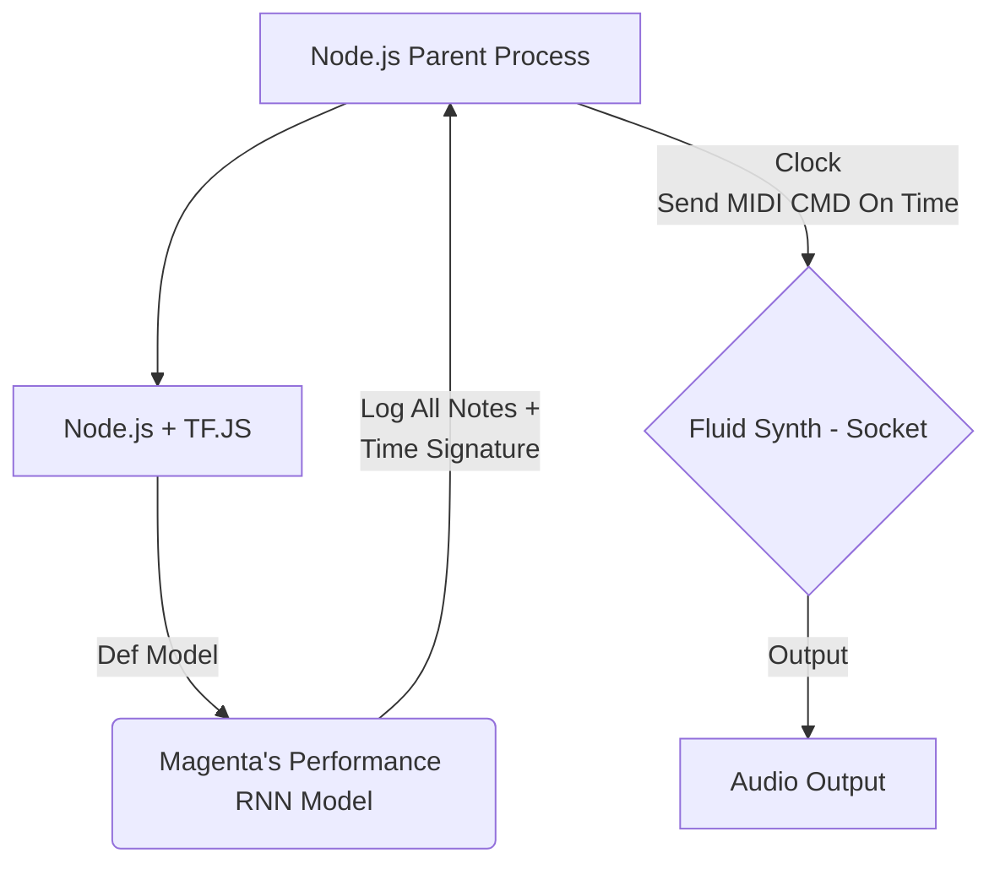

# rnn-jukebox
A node-driven jukebox based on Magenta's performance-rnn, make to run on Horizon-X3 Pi or Raspberry Pi (CPU)

---

`Hardware (X3Pi)`

`Output (MP4)`

<video src="https://raw.githubusercontent.com/luan007/rnn-jukebox/main/imgs/output.mp4" controls style="max-width: 400px;"></video>

----

# How does it work?

The project 

